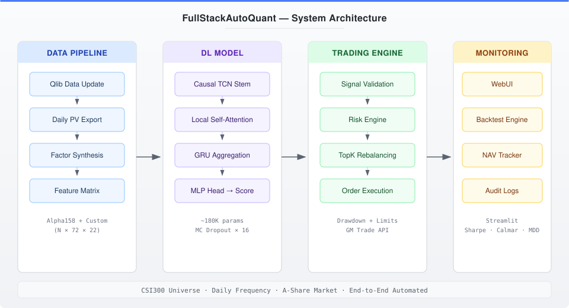
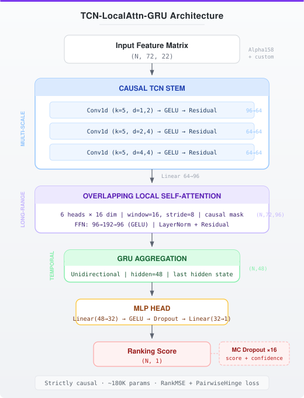

<p align="center">
  <h1 align="center">FullStackAutoQuant</h1>
  <p align="center">
    <strong>Sistema de Trading Cuantitativo de Deep Learning de Extremo a Extremo</strong>
  </p>
  <p align="center">
    <a href="https://github.com/Zizhao-HUANG/FullStackAutoQuant/actions/workflows/ci.yml">
      
    </a>
    
    
    
    
  </p>
</p>

---

**FullStackAutoQuant** es un sistema de trading cuantitativo completamente automatizado de nivel de producción que cubre todo el pipeline, desde la ingestión de datos de mercado en bruto hasta la ejecución de operaciones en tiempo real. A diferencia de la mayoría de los proyectos de cuant (quant) de código abierto que se centran en un único componente (modelo O backtesting O ejecución), este sistema integra todas las etapas en un pipeline automatizado y cohesivo.

## Arquitectura

<p align="center">
  
</p>

## Características Clave

| Módulo | Qué hace |
|--------|-------------|
| **Pipeline de Datos** | Actualización automatizada de datos mediante Tushare (ligero) o Docker/Dolt (historial completo), síntesis personalizada de factores (Alpha158 + 2 factores propietarios) y construcción de matrices de características |
| **Modelo de Deep Learning** | Arquitectura propietaria TCN Attention GRU con causalidad temporal estricta para ranking accionario transversal |
| **Estimación de Incertidumbre** | MC Dropout (16 pasadas) genera puntuaciones de confianza por acción; las señales de baja confianza se filtran antes del trading |
| **Gestión de Riesgos** | Controles multicapa: límites de máximo drawdown, filtrado de estados de límite, topes de posición y umbrales de confianza |
| **Trading en Vivo** | Ejecución de órdenes a partir de señales mediante la API JoinQuant/GM Trade con programación diaria automatizada |
| **Motor de Backtesting** | Simulador completo con seguimiento de NAV, costes de transacción y métricas de rendimiento estándar |
| **Panel WebUI** | Interfaz de Streamlit para supervisión de carteras, anulaciones manuales y operaciones con un solo clic |

## Modelo

<p align="center">
  
</p>

### TCN LocalAttention GRU

Una arquitectura híbrida de deep learning (~180K parámetros) diseñada para el ranking accionario transversal. El pipeline combina tres etapas complementarias:

- **TCN Causal**: extrae patrones temporales multiscale mientras impone una causalidad estricta (sin filtración de datos futuros)
- **Local Attention solapado**: captura dependencias a largo plazo entre pasos temporales mediante enmascaramiento causal
- **Agregación GRU**: comprime la secuencia temporal en una representación de longitud fija para el ranking

**Decisiones clave de diseño:**
- **Cero filtración futura**: convoluciones causales + atención enmascarada en todo el pipeline
- **Inferencia con MC Dropout**: el muestreo Monte Carlo de 16 pasadas genera puntuaciones de confianza por acción, permitiendo un dimensionado de posiciones consciente de la incertidumbre
- **Consistencia entrenamiento8-servicio**: la inferencia utiliza exactamente los mismos `DataHandlerLP` + procesadores que el entrenamiento para eliminar sesgos de distribución

> Para especificaciones detalladas de capas e hiperparámetros, consulta la [Guía de Arquitectura](docs/architecture.md).

## Rendimiento

> **Aviso legal:** El rendimiento pasado no garantiza resultados futuros. Este sistema se proporciona únicamente con fines de investigación y educación.

Evaluado en el universo CSI300 utilizando `TopkDropoutStrategy` de Qlib (TopK solo long, rebalanceo diario):

| Métrica | Con Costes | Sin Costes |
|--------|-----------|--------------|
| **Rendimiento Anual Excedente** | **16.72%** | 21.38% |
| **Máximo Drawdown** | **-4.60%** | -4.41% |
| **Ratio de Información** | **1.96** | 2.51 |

<details>
<summary><b>Métricas de Calidad de Señal</b></summary>

| Métrica | Valor |
|--------|-------|
| IC (Coeficiente de Información) | 0.032 |
| Rank IC | 0.036 |
| ICIR | 0.216 |
| Rank ICIR | 0.231 |

> "Con Costes" incluye los costes de transacción estándar de Qlib (comisión + deslizamiento). El rendimiento excedente se mide en relación con el índice de referencia CSI300.

</details>

<details>
<summary><b>Configuración de Entrenamiento</b></summary>

| Parámetro | Valor |
|-----------|-------|
| Función de pérdida | RankMSE (error cuadrático medio consciente del ranking) |
| Ventana de observación (Lookback) | 72 días de negociación |
| Espacio de características | 22 dimensiones (20 Alpha158 + 2 factores personalizados) |
| Período de entrenamiento | 04-01-2005 al 31-12-2021 |
| Parámetros | ~180K |

</details>

## Inicio Rápido

### 1. Instalación

```bash
git clone https://github.com/Zizhao-HUANG/FullStackAutoQuant.git
cd FullStackAutoQuant
pip install -e ".[all]"
```

### 2. Configuración

```bash
cp .env.example .env
# Edita .env con tu token de Tushare (requerido) y opcionalmente las credenciales de GM Trade
```

### 3. Ejecutar Inferencia (Pipeline Lite, Recomendado)

El Pipeline Lite utiliza Tushare para obtener datos de mercado recientes, y luego ejecuta la síntesis de factores y la inferencia del modelo con un solo comando. No se requiere Docker.

```bash
export TUSHARE=<your_tushare_token>
python scripts/run_inference_lite.py --date auto
```

Salida: `output/ranked_scores.csv`. Requiere una cuenta de [Tushare Pro](https://tushare.pro/register) (2000+ puntos) y pesos preentrenados en `weights/`.

### 4. Iniciar Panel (Opcional)

```bash
make webui
```

<details>
<summary><b>Legado: Pipeline de Historial Completo (Docker/Dolt)</b></summary>

Para construir datos históricos completos (2005 hasta la presente) utilizando el pipeline Docker/Dolt:

```bash
# Requiere Docker instalado y en ejecución
export TUSHARE=<your_tushare_token>
bash fullstackautoquant/data/qlib_update.sh
```

Esto clona el conjunto de datos completo de acciones A (~5 GB) y genera datos binarios de Qlib. La primera ejecución tarda entre 30 y 60 minutos.

Después de construir el historial completo, extrae la caché del normalizador:
```bash
python scripts/extract_norm_cache.py
```

</details>

## Estructura del Proyecto

```
FullStackAutoQuant/
├── fullstackautoquant/
│   ├── model/             # Arquitectura de red neuronal e inferencia
│   │   ├── architecture.py    # Definición del modelo TCN Attention GRU
│   │   ├── inference.py       # Pipeline de inferencia de producción
│   │   ├── norm_cache.py      # Caché de parámetros del normalizador
│   │   ├── scoring.py         # Ranking de señales y puntuación de confianza
│   │   ├── task_config.py     # Cargador de configuración de entrenamiento
│   │   ├── factors/           # Definiciones de factores alfa personalizados
│   │   └── io/                # Utilidades de carga de datos
│   ├── data/              # Pipeline de datos
│   │   ├── tushare_provider.py    # Tushare -> binario de Qlib (Pipeline Lite)
│   │   ├── qlib_update.sh        # Actualización de historial completo (Docker/Dolt)
│   │   ├── factor_synthesis.py    # Cálculo de factores personalizados
│   │   ├── build_features.py     # Construcción de matriz de características
│   │   └── verify/               # Scripts de verificación de datos
│   ├── trading/           # Ejecución de trading
│   │   ├── strategy.py        # Rebalanceo TopK con pesos water-fill
│   │   ├── execution.py       # Envoltorio de API JoinQuant/GM Trade
│   │   ├── risk/              # Motor de gestión de riesgos
│   │   ├── signals/           # Análisis y validación de señales
│   │   └── scheduler.py       # Programador diario automatizado
│   ├── backtest/          # Motor de backtesting
│   │   ├── engine.py          # Orquestador principal de backtesting
│   │   ├── pipeline.py        # Pipeline de backtesting modular
│   │   ├── metrics.py         # Métricas de rendimiento (Sharpe, drawdown, etc.)
│   │   └── components/        # Componentes encajables (NAV, riesgo, ejecución)
│   └── webui/             # Panel de Streamlit
├── configs/               # Archivos y esquemas de configuración
├── weights/               # Pesos del modelo (preentrenados)
├── tests/                 # Suite de pruebas (300+ pruebas)
├── scripts/               # Scripts de utilidad
│   ├── run_inference_lite.py   # Inferencia diaria con un solo comando
│   ├── extract_norm_cache.py  # Extracción única del normalizador
│   └── build_full_history.py  # Constructor de historial completo
└── docs/                  # Documentación
```

## Documentación

| Documento | Descripción |
|----------|-------------|
| [Guía de Arquitectura](docs/architecture.md) | Arquitectura detallada del modelo y justificación del diseño |
| [Pipeline de Datos](docs/data_pipeline.md) | Ingestión de datos, síntesis de factores y verificación |
| [Sistema de Trading](docs/trading_system.md) | Motor de ejecución y gestión de riesgos |
| [Guía de Despliegue](docs/deployment.md) | Despliegue de producción y operaciones diarias |
| [Caché del Normalizador](docs/normalizer_caching.md) | Parámetros de normalización en caché para inferencia |

## Stack Tecnológico

| Categoría | Tecnologías |
|----------|-------------|
| **Deep Learning** | PyTorch 2.0+, capas TCN / Attention / GRU personalizadas |
| **Framework Quant** | Microsoft Qlib (gestión de datos, manejo de conjuntos de datos) |
| **Datos de Mercado** | API Tushare (principal), pipeline Docker/Dolt (historial completo) |
| **API de Trading** | JoinQuant GM Trade (mercado de acciones A) |
| **Backtesting** | Motor personalizado con arquitectura de componentes encajables |
| **Panel** | Streamlit |
| **Formatos de Datos** | Parquet, HDF5, binario Qlib |

## Reconocimientos

Este proyecto se basa en varios proyectos de código abierto excelentes:

- [Microsoft Qlib](https://github.com/microsoft/qlib), Framework de inversión cuantitativa (Licencia MIT)
- [Microsoft RD-Agent](https://github.com/microsoft/RD-Agent), Búsqueda automatizada de arquitectura de modelos (Licencia MIT)
- [chenditc/investment_data](https://github.com/chenditc/investment_data), Pipeline de datos de acciones A colaborativo (Apache 2.0)
- [Tushare](https://tushare.pro/), API de datos de mercados financieros

## Contribución

¡Las contribuciones son bienvenidas! Por favor, consulta [CONTRIBUTING.md](CONTRIBUTING.md) para las pautas.

## Licencia

Este proyecto está licenciado bajo **Creative Commons Attribution-NonCommercial-ShareAlike 4.0 International (CC BY-NC-SA 4.0)**. Consulta [LICENSE](LICENSE) para más detalles.

Eres libre de compartir y adaptar este trabajo para fines no comerciales con la atribución adecuada. El uso comercial no está permitido sin el consentimiento explícito por escrito del autor.

---

<p align="center">
  <sub>Creado con <3 por <a href="https://github.com/Zizhao-HUANG">Zizhao Huang</a></sub>
</p>
