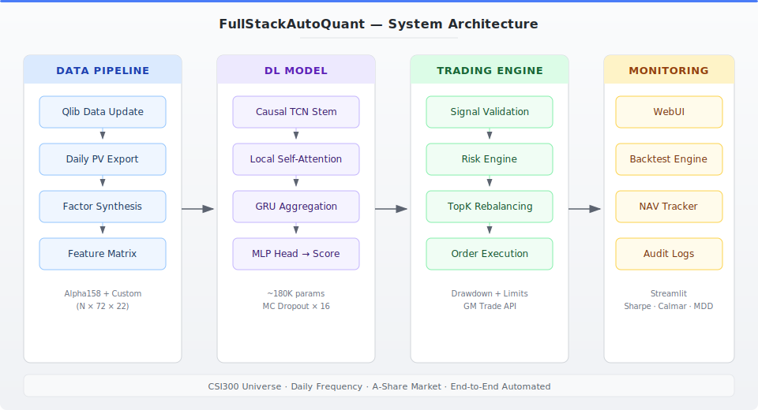
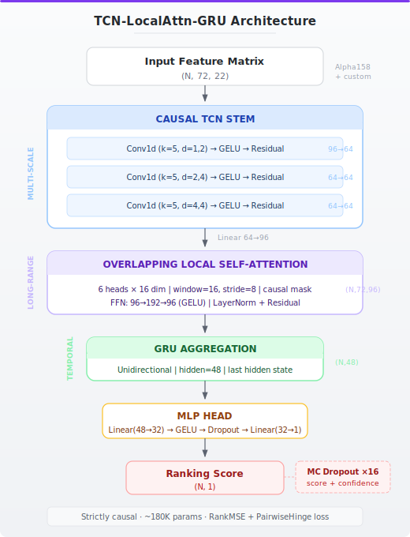

<p align="center">
  <h1 align="center">FullStackAutoQuant</h1>
  <p align="center">
    <strong>End-to-End Deep Learning Quantitative Trading System</strong>
  </p>
  <p align="center">
    <a href="#features">Features</a> •
    <a href="#architecture">Architecture</a> •
    <a href="#quick-start">Quick Start</a> •
    <a href="#model">Model</a> •
    <a href="#documentation">Docs</a> •
    <a href="#license">License</a>
  </p>
  <p align="center">
    
    
    
    
    <a href="https://github.com/Zizhao-HUANG/FullStackAutoQuant/actions/workflows/ci.yml"></a>
  </p>

---

**FullStackAutoQuant** is a production-grade, fully automated quantitative trading system that covers the entire pipeline from raw market data ingestion to live trade execution. Unlike most open-source quant projects that focus on a single component (model OR backtesting OR execution), this system integrates **all stages** into a cohesive, automated pipeline.

## Features

| Component | Capability |
|-----------|-----------|
| **Deep Learning Model** | Proprietary TCN-Attention-GRU hybrid architecture for multi-scale temporal stock ranking |
| **Data Pipeline** | Automated Qlib data updates, custom factor synthesis, and feature engineering |
| **Inference Engine** | Training-equivalent data pipeline with MC Dropout uncertainty estimation |
| **Automated Trading** | Signal-to-order execution with JoinQuant/GM Trade API integration |
| **Risk Management** | Multi-layer risk control: drawdown monitoring, limit-state filtering, confidence thresholds |
| **Backtesting Engine** | Full simulator with NAV tracking, transaction costs, and performance metrics |
| **WebUI** | Streamlit dashboard for manual portfolio oversight and one-click operations |

## Architecture

<p align="center">
  
</p>

### Model Architecture

<p align="center">
  
</p>

### Data Flow

```
Daily Qlib Update ──→ Factor Synthesis ──→ Feature Matrix (N, 72, 22)
                                              │
                                              ▼
                                      TCN-Attention-GRU Model
                                              │
                                              ▼
                                    Ranked Scores + Confidence
                                              │
                                              ▼
                                  Risk Filter ──→ Rebalancing Strategy
                                                        │
                                                        ▼
                                                Order Execution
```

## Model

### TCN-LocalAttention-GRU (`TCN_LocalAttn_GRU_L72_RankMSE_Balanced_v2`)

A hybrid deep learning architecture designed for stock ranking with **strict temporal causality**:

| Layer | Purpose | Key Design |
|-------|---------|-----------|
| **Input Projection** | `(N,72,F) → (N,72,96)` | Linear embedding to d_model=96 |
| **Causal TCN Stem** | Multi-scale temporal patterns | 3 residual blocks, dilations [1,2,4], causal padding |
| **Overlapping Local Attention** | Long-range dependencies | Window=16, stride=8, 6 heads, causal masking |
| **GRU** | Sequence aggregation | hidden=48, last hidden state as summary |
| **MLP Head** | Prediction | 48→24→1, GELU activation, LayerNorm |

**Key innovations:**
- **Strict causality** throughout: causal convolutions + masked attention prevent future data leakage
- **Overlapping windows** in attention: stride < window ensures no information gaps between adjacent windows
- **MC Dropout inference**: 16-pass Monte Carlo sampling produces confidence scores alongside predictions
- **Training-equivalent inference**: the inference pipeline uses the exact same DataHandlerLP + processors as training to eliminate train-serve skew

## Quick Start

### 1. Prerequisites

```bash
# Clone the repository
git clone https://github.com/Zizhao-HUANG/FullStackAutoQuant.git
cd FullStackAutoQuant

# Install dependencies
pip install -e ".[all]"

# Configure environment
cp .env.example .env
# Edit .env with your Tushare token and (optionally) GM Trade credentials
```

### 2. Initialize Data

```bash
# Update Qlib data (requires Docker)
bash fullstackautoquant/data/qlib_update.sh
```

### 3. Run Inference

```bash
python -m fullstackautoquant.model.inference \
  --date auto \
  --combined_factors ./data/combined_factors_df.parquet \
  --params ./weights/params.pkl \
  --out ./output/ranked_scores.csv
```

### 4. Launch WebUI (Optional)

```bash
make webui
```

## Project Structure

```
FullStackAutoQuant/
├── fullstackautoquant/
│   ├── model/             # Neural network architecture & inference
│   │   ├── architecture.py    # TCN-Attention-GRU model definition
│   │   ├── inference.py       # Production inference pipeline
│   │   ├── scoring.py         # Signal ranking & confidence scoring
│   │   ├── task_config.py     # Training config loader
│   │   ├── factors/           # Custom alpha factor definitions
│   │   └── io/                # Data loading utilities
│   ├── data/              # Data pipeline
│   │   ├── qlib_update.sh     # Automated Qlib data update (Docker)
│   │   ├── factor_synthesis.py # Custom factor computation
│   │   ├── build_features.py  # Feature matrix construction
│   │   └── verify/            # Data verification scripts
│   ├── trading/           # Trading execution
│   │   ├── strategy.py        # TopK rebalancing with water-fill weights
│   │   ├── execution.py       # JoinQuant/GM Trade API wrapper
│   │   ├── risk/              # Risk management engine
│   │   ├── signals/           # Signal parsing & validation
│   │   └── scheduler.py       # Automated daily scheduler
│   ├── backtest/          # Backtesting engine
│   │   ├── engine.py          # Core backtesting orchestrator
│   │   ├── pipeline.py        # Modular backtesting pipeline
│   │   ├── metrics.py         # Performance metrics (Sharpe, drawdown, etc.)
│   │   └── components/        # Pluggable components (NAV, risk, execution)
│   └── webui/             # Streamlit dashboard
├── configs/               # Configuration files & schemas
├── weights/               # Model weights (pre-trained)
├── tests/                 # Test suite
├── docs/                  # Documentation
└── scripts/               # Utility scripts
```

## Documentation

| Document | Description |
|----------|-------------|
| [Architecture Guide](docs/architecture.md) | Detailed model architecture analysis |
| [Deployment Guide](docs/deployment.md) | Production deployment instructions |
| [Data Pipeline](docs/data_pipeline.md) | Data ingestion and factor synthesis |
| [Trading System](docs/trading_system.md) | Execution and risk management |

## Technology Stack

| Category | Technologies |
|----------|-------------|
| **Deep Learning** | PyTorch 2.0+, custom TCN/Attention/GRU layers |
| **Quant Framework** | Microsoft Qlib (data handling, dataset management) |
| **Market Data** | Tushare API, Dongcai (East Money) fallback |
| **Trading API** | JoinQuant GM Trade (A-share market) |
| **Backtesting** | Custom engine with modular component architecture |
| **WebUI** | Streamlit |
| **Data Storage** | Parquet, HDF5, Qlib binary format |

## Performance

> **Disclaimer:** Past performance does not guarantee future results. This system is provided for educational and research purposes.

### Backtest Results (Qlib Official Framework)

Evaluated on **CSI300** universe using Qlib's `TopkDropoutStrategy` (Top-K long-only, daily rebalance):

| Metric | With Cost | Without Cost |
|--------|-----------|--------------|
| **Annualized Excess Return** | **16.72%** | 21.38% |
| **Max Drawdown** | **−4.60%** | −4.41% |
| **Information Ratio** | **1.96** | 2.51 |

| Signal Quality Metric | Value |
|----------------------|-------|
| IC (Information Coefficient) | 0.032 |
| Rank IC | 0.036 |
| ICIR | 0.216 |
| Rank ICIR | 0.231 |

> **Note:** "With Cost" includes standard Qlib transaction costs (commission + slippage). The excess return is measured against the CSI300 benchmark.

### Training Configuration

The model is trained on CSI300 universe data with:
- **Loss function:** RankMSE (ranking-aware mean squared error)
- **Lookback window:** 72 trading days
- **Feature space:** 22 dimensions (20 Alpha158 + 2 custom factors)
- **Training period:** 2005-01-04 to 2021-12-31

## Acknowledgments

This project builds upon several excellent open-source projects:

- [Microsoft Qlib](https://github.com/microsoft/qlib) — Quantitative investment framework (MIT License)
- [Microsoft RD-Agent](https://github.com/microsoft/RD-Agent) — Automated model architecture search (MIT License)
- [chenditc/investment_data](https://github.com/chenditc/investment_data) — A-share crowdsourced data pipeline (Apache 2.0)
- [Tushare](https://tushare.pro/) — Financial market data API

## Contributing

Contributions are welcome! Please see [CONTRIBUTING.md](CONTRIBUTING.md) for guidelines.

## License

This project is licensed under the Apache License 2.0 — see [LICENSE](LICENSE) for details.

---

<p align="center">
  <sub>Built with ❤️ by <a href="https://github.com/Zizhao-HUANG">Zizhao Huang</a></sub>
</p>
