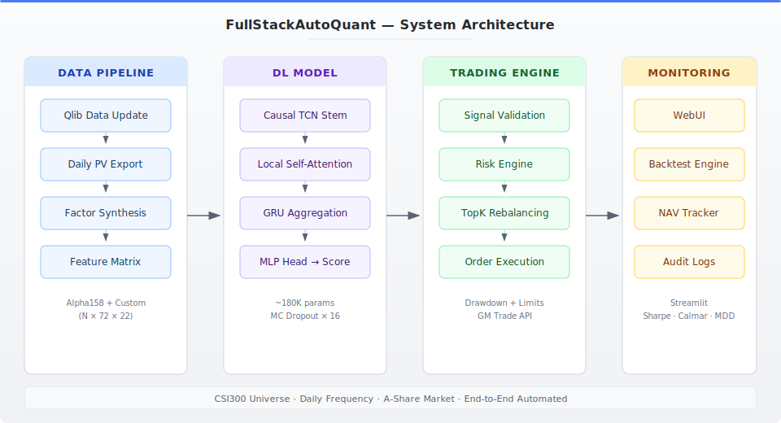
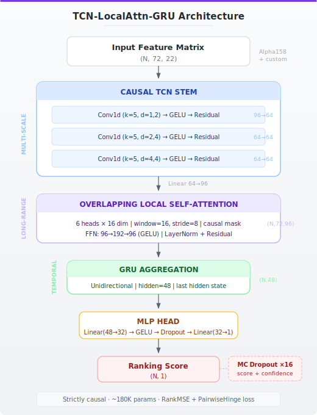

<p align="center">
  <h1 align="center">FullStackAutoQuant</h1>
  <p align="center">
    <strong>End to End Deep Learning Quantitative Trading System</strong>
  </p>
  <p align="center">
    <a href="https://github.com/Zizhao-HUANG/FullStackAutoQuant/actions/workflows/ci.yml">
      
    </a>
    
    
    
    
  </p>
  <p align="center">
    <a href="https://zizhao-huang.github.io/FullStackAutoQuant/">
      
    </a>
  </p>
</p>

---

**FullStackAutoQuant** is a production grade, fully automated quantitative trading system that covers the entire pipeline from raw market data ingestion to live trade execution. Unlike most open source quant projects that focus on a single component (model OR backtesting OR execution), this system integrates **all stages** into a cohesive, automated pipeline.

## Architecture

<p align="center">
  
</p>

## Key Features

| Module | What it does |
|--------|-------------|
| **Data Pipeline** | Automated data updates via Tushare (lightweight) or Docker/Dolt (full history), custom factor synthesis (Alpha158 + 2 proprietary factors), and feature matrix construction |
| **Deep Learning Model** | Proprietary TCN Attention GRU architecture with strict temporal causality for cross sectional stock ranking |
| **Uncertainty Estimation** | MC Dropout (16 pass) produces per stock confidence scores; low confidence signals are filtered before trading |
| **Risk Management** | Multilayer controls: max drawdown limits, limit state filtering, position caps, and confidence thresholds |
| **Live Trading** | Signal to order execution via JoinQuant/GM Trade API with automated daily scheduling |
| **Backtesting Engine** | Full simulator with NAV tracking, transaction costs, and standard performance metrics |
| **WebUI Dashboard** | Streamlit interface for portfolio oversight, manual overrides, and one click operations |

## Model

<p align="center">
  
</p>

### TCN LocalAttention GRU

A hybrid deep learning architecture (~180K parameters) designed for **cross sectional stock ranking**. The pipeline combines three complementary stages:

- **Causal TCN**: extracts multiscale temporal patterns while enforcing strict causality (no future data leakage)
- **Overlapping Local Attention**: captures long range dependencies across time steps with causal masking
- **GRU Aggregation**: compresses the temporal sequence into a fixed length representation for ranking

**Key design decisions:**
- **Zero future leakage**: causal convolutions + masked attention throughout the entire pipeline
- **MC Dropout inference**: 16 pass Monte Carlo sampling produces per stock confidence scores, enabling uncertainty aware position sizing
- **Train serve consistency**: inference uses the exact same `DataHandlerLP` + processors as training to eliminate distribution skew

> For detailed layer specifications and hyperparameters, see [Architecture Guide](docs/architecture.md).

## Performance

> **Disclaimer:** Past performance does not guarantee future results. This system is provided for research and educational purposes only.

Evaluated on **CSI300 universe** using Qlib's `TopkDropoutStrategy` (TopK long only, daily rebalance):

| Metric | With Cost | Without Cost |
|--------|-----------|--------------|
| **Annualized Excess Return** | **16.72%** | 21.38% |
| **Max Drawdown** | **-4.60%** | -4.41% |
| **Information Ratio** | **1.96** | 2.51 |

<details>
<summary><b>Signal Quality Metrics</b></summary>

| Metric | Value |
|--------|-------|
| IC (Information Coefficient) | 0.032 |
| Rank IC | 0.036 |
| ICIR | 0.216 |
| Rank ICIR | 0.231 |

> "With Cost" includes standard Qlib transaction costs (commission + slippage). Excess return is measured against the CSI300 benchmark.

</details>

<details>
<summary><b>Training Configuration</b></summary>

| Parameter | Value |
|-----------|-------|
| Loss function | RankMSE (ranking aware mean squared error) |
| Lookback window | 72 trading days |
| Feature space | 22 dimensions (20 Alpha158 + 2 custom factors) |
| Training period | 2005-01-04 to 2021-12-31 |
| Parameters | ~180K |

</details>

## Quick Start

### 1. Installation

```bash
git clone https://github.com/Zizhao-HUANG/FullStackAutoQuant.git
cd FullStackAutoQuant
pip install -e ".[all]"
```

### 2. Configuration

```bash
cp .env.example .env
# Edit .env with your Tushare token (required) and optionally GM Trade credentials
```

### 3. Run Inference (Lite Pipeline, Recommended)

The Lite Pipeline uses Tushare to fetch recent market data, then runs factor synthesis and model inference in a single command. No Docker required.

```bash
export TUSHARE=<your_tushare_token>
python scripts/run_daily_lite.py --date auto
```

Output: `output/ranked_scores.csv`. Requires a [Tushare Pro](https://tushare.pro/register) account (2000+ points) and pretrained weights in `weights/`.

### 4. Launch Dashboard (Optional)

```bash
make webui
```

<details>
<summary><b>Legacy: Full History Pipeline (Docker/Dolt)</b></summary>

For building full historical data (2005 to present) using the Docker/Dolt pipeline:

```bash
# Requires Docker installed and running
export TUSHARE=<your_tushare_token>
bash fullstackautoquant/data/qlib_update.sh
```

This clones the full A-share dataset (~5 GB) and produces Qlib binary data. First run takes 30 to 60 minutes.

After building full history, extract normalizer cache:
```bash
python scripts/extract_norm_cache.py
```

</details>

## Project Structure

```
FullStackAutoQuant/
├── fullstackautoquant/
│   ├── model/             # Neural network architecture & inference
│   │   ├── architecture.py    # TCN Attention GRU model definition
│   │   ├── inference.py       # Production inference pipeline
│   │   ├── norm_cache.py      # Normalizer parameter caching
│   │   ├── scoring.py         # Signal ranking & confidence scoring
│   │   ├── task_config.py     # Training config loader
│   │   ├── factors/           # Custom alpha factor definitions
│   │   └── io/                # Data loading utilities
│   ├── data/              # Data pipeline
│   │   ├── tushare_provider.py    # Tushare -> Qlib binary (Lite Pipeline)
│   │   ├── qlib_update.sh        # Full history update (Docker/Dolt)
│   │   ├── factor_synthesis.py    # Custom factor computation
│   │   ├── build_features.py     # Feature matrix construction
│   │   └── verify/               # Data verification scripts
│   ├── trading/           # Trading execution
│   │   ├── strategy.py        # TopK rebalancing with water-fill weights
│   │   ├── execution.py       # JoinQuant/GM Trade API wrapper
│   │   ├── risk/              # Risk management engine
│   │   ├── signals/           # Signal parsing & validation
│   │   └── scheduler.py       # Automated daily scheduler
│   ├── backtest/          # Backtesting engine
│   │   ├── engine.py          # Core backtesting orchestrator
│   │   ├── pipeline.py        # Modular backtesting pipeline
│   │   ├── metrics.py         # Performance metrics (Sharpe, drawdown, etc.)
│   │   └── components/        # Pluggable components (NAV, risk, execution)
│   └── webui/             # Streamlit dashboard
├── configs/               # Configuration files & schemas
├── weights/               # Model weights (pretrained)
├── tests/                 # Test suite (300+ tests)
├── scripts/               # Utility scripts
│   ├── run_daily_lite.py      # Single command daily inference
│   ├── extract_norm_cache.py  # One time normalizer extraction
│   └── build_full_history.py  # Full history builder
└── docs/                  # Documentation
```

## Documentation

| Document | Description |
|----------|-------------|
| [Architecture Guide](docs/architecture.md) | Detailed model architecture and design rationale |
| [Data Pipeline](docs/data_pipeline.md) | Data ingestion, factor synthesis, and verification |
| [Trading System](docs/trading_system.md) | Execution engine and risk management |
| [Deployment Guide](docs/deployment.md) | Production deployment and daily operations |
| [Normalizer Caching](docs/normalizer_caching.md) | Cached normalization parameters for inference |

## Technology Stack

| Category | Technologies |
|----------|-------------|
| **Deep Learning** | PyTorch 2.0+, custom TCN / Attention / GRU layers |
| **Quant Framework** | Microsoft Qlib (data handling, dataset management) |
| **Market Data** | Tushare API (primary), Docker/Dolt pipeline (full history) |
| **Trading API** | JoinQuant GM Trade (A share market) |
| **Backtesting** | Custom engine with pluggable component architecture |
| **Dashboard** | Streamlit |
| **Data Formats** | Parquet, HDF5, Qlib binary |

## Acknowledgments

This project builds upon several excellent open source projects:

- [Microsoft Qlib](https://github.com/microsoft/qlib), Quantitative investment framework (MIT License)
- [Microsoft RD-Agent](https://github.com/microsoft/RD-Agent), Automated model architecture search (MIT License)
- [chenditc/investment_data](https://github.com/chenditc/investment_data), A share crowdsourced data pipeline (Apache 2.0)
- [Tushare](https://tushare.pro/), Financial market data API

## Contributing

Contributions are welcome! Please see [CONTRIBUTING.md](CONTRIBUTING.md) for guidelines.

## License

This project is licensed under **Creative Commons Attribution-NonCommercial-ShareAlike 4.0 International (CC BY-NC-SA 4.0)**. See [LICENSE](LICENSE) for details.

You are free to share and adapt this work for **noncommercial purposes** with proper attribution. Commercial use is **not permitted** without explicit written consent from the author.

---

<p align="center">
  <sub>Built with <3 by <a href="https://github.com/Zizhao-HUANG">Zizhao Huang</a></sub>
</p>
