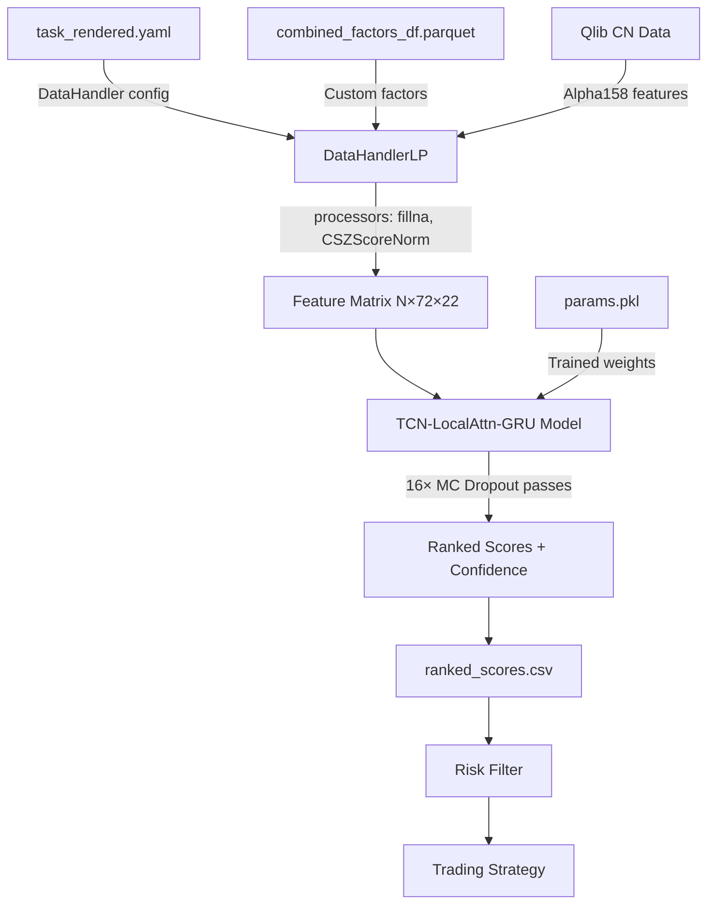

# Architecture Guide

> Deep dive into the TCN-LocalAttention-GRU model that powers FullStackAutoQuant's stock ranking engine.

---

## Table of Contents

- [Model Overview](#model-overview)
- [Design Philosophy](#design-philosophy)
- [Layer-by-Layer Breakdown](#layer-by-layer-breakdown)
  - [1. Input Projection](#1-input-projection)
  - [2. Causal TCN Stem](#2-causal-tcn-stem)
  - [3. Overlapping Local Self-Attention](#3-overlapping-local-self-attention)
  - [4. GRU Aggregation](#4-gru-aggregation)
  - [5. MLP Head](#5-mlp-head)
- [Training Configuration](#training-configuration)
- [Loss Function](#loss-function)
- [MC Dropout Uncertainty Estimation](#mc-dropout-uncertainty-estimation)
- [Inference Pipeline](#inference-pipeline)
- [Tensor Shape Reference](#tensor-shape-reference)
- [Backtest Performance](#backtest-performance)

---

## Model Overview

**`TCN_LocalAttn_GRU_L72_RankMSE_Balanced_v2`** is a hybrid deep learning architecture designed for daily stock ranking on the CSI300 universe. The model was discovered and evolved through [Microsoft RD-Agent](https://github.com/microsoft/RD-Agent)'s automated research loop, then manually refined with production constraints.

The architecture processes multi-variate financial time series of shape `(N, 72, 22)` — i.e., **N** instruments, each with **72** trading days of **22** features — and outputs a scalar ranking score per instrument.

**Key properties:**
- **Strict temporal causality** — no future information leakage at any layer
- **Multi-scale temporal modeling** — dilated convolutions capture patterns at 1-day, 2-day, and 4-day scales
- **Efficient long-range attention** — overlapping local windows cover the full 72-step sequence without quadratic cost
- **Uncertainty quantification** — MC Dropout produces calibrated confidence scores alongside predictions

<p align="center">
  
</p>

---

## Design Philosophy

The architecture addresses three challenges specific to financial time series prediction:

1. **Future leakage prevention.** Standard transformers and bidirectional RNNs violate causality. Every layer here uses strictly causal operations: left-padded convolutions, causal attention masks, and unidirectional GRU.

2. **Multi-scale pattern extraction.** Market signals exist at multiple timescales — intraday momentum (1-day), weekly trends (5-day), monthly regime shifts (20-day). The dilated TCN stem captures these without pooling or strided convolutions that would lose temporal resolution.

3. **Computational efficiency.** Full self-attention over 72 timesteps is feasible but wasteful for daily financial data. Overlapping local attention with window=16, stride=8 achieves O(n·w) cost while maintaining full sequence coverage through window overlap — no information gaps between adjacent windows.

---

## Layer-by-Layer Breakdown

### 1. Input Projection

```
Linear: (N, 72, F) → (N, 72, 96)
```

| Parameter | Value |
|-----------|-------|
| Input features `F` | 22 (20 Alpha158 + 2 custom factors) |
| Output dimension `d_model` | 96 |
| Bias | Yes |

A simple linear embedding maps the raw feature space into a higher-dimensional representation. No activation function — the subsequent layers handle nonlinearity.

**Rationale:** The 22 input features have heterogeneous scales (already normalized to [-3, 3] by CSZScoreNorm). Linear projection learns feature-specific scaling before temporal modeling begins.

### 2. Causal TCN Stem

```
3× ResidualTCNBlock: (N, 72, 96) → (N, 72, 64) → (N, 72, 64) → (N, 72, 64)
Post-TCN Projection: (N, 72, 64) → (N, 72, 96)
```

Three stacked residual blocks with increasing dilation factors:

| Block | In → Out | Kernel | Dilations (d₁, d₂) | Receptive Field |
|-------|----------|--------|---------------------|-----------------|
| Block 1 | 96 → 64 | 5 | (1, 2) | 13 timesteps |
| Block 2 | 64 → 64 | 5 | (2, 4) | +24 timesteps |
| Block 3 | 64 → 64 | 5 | (4, 4) | +32 timesteps |

Each `ResidualTCNBlock` contains:
```
LayerNorm → CausalConv1d(k, d₁) → GELU → Dropout(0.1)
          → CausalConv1d(k, d₂) → GELU → Dropout(0.1) → + residual
```

**Causal padding strategy:** Each `CausalConv1d` pads `(kernel_size - 1) × dilation` zeros to the left, then truncates the right. This ensures the output at position `t` depends only on inputs at positions `≤ t`.

**Channel reduction:** Block 1 reduces channels from 96 → 64 via a 1×1 residual projection. Blocks 2–3 maintain 64 channels with identity residuals. A final linear layer projects back to d_model=96 for the attention layer.

### 3. Overlapping Local Self-Attention

```
LocalSelfAttentionOverlap: (N, 72, 96) → (N, 72, 96)
```

| Parameter | Value |
|-----------|-------|
| Window size | 16 |
| Stride | 8 |
| Number of heads | 6 |
| Head dimension | 16 |
| Inner dimension | 96 (6 × 16) |

**How it works:**

1. The sequence of length 72 is sliced into overlapping windows with stride 8:
   - Windows start at positions: 0, 8, 16, 24, 32, 40, 48, 56
   - Each window sees 16 timesteps
   - **50% overlap** ensures no timestep falls in a "boundary gap"

2. Within each window, standard multi-head self-attention is computed with a **causal mask** — position `i` can only attend to positions `≤ i`.

3. Where windows overlap, outputs are averaged (weighted equally), producing a smooth transition.

4. Post-attention: LayerNorm → 2-layer FFN (96 → 192 → 96 with GELU) → residual + LayerNorm.

**Why overlapping?** Non-overlapping windows create hard boundaries where information cannot flow between adjacent segments. Overlap ensures that every position has at least two different "views" of its context, similar to how overlapping patches work in Vision Transformers.

### 4. GRU Aggregation

```
GRU: (N, 72, 96) → hidden state (N, 48)
```

| Parameter | Value |
|-----------|-------|
| Input size | 96 |
| Hidden size | 48 |
| Layers | 1 |
| Bidirectional | No (causal) |

The GRU processes the full 72-step sequence and outputs the **last hidden state** as a fixed-length summary vector. This is a deliberate choice over average pooling or attention pooling:

- **Last hidden state** captures the cumulative information up to the most recent timestep
- Unidirectional ensures causality
- Single layer is sufficient because the TCN + Attention have already extracted rich temporal features

### 5. MLP Head

```
Linear(48, 32) → GELU → Dropout(0.1) → Linear(32, 1)
```

A lightweight 2-layer MLP maps the GRU summary to a scalar prediction. No final activation — the output is an unbounded ranking score optimized with RankMSE loss.

---

## Training Configuration

| Hyperparameter | Value | Notes |
|----------------|-------|-------|
| Epochs | 95 | With early stopping (patience=10) |
| Batch size | 256 | Per-GPU |
| Optimizer | AdamW | β=(0.9, 0.999), ε=1e-8 |
| Learning rate | 2e-4 | With cosine annealing |
| LR scheduler | CosineAnnealingLR + Warmup | T_max=95, η_min=1e-6, warmup=1000 steps |
| Weight decay | 1e-4 | Applied to all parameters |
| Gradient clipping | 0.8 (norm) | Prevents gradient explosions |
| Precision | bf16 | Mixed precision for memory efficiency |
| Seed | 42 | Reproducibility |
| Lookback window | 72 days | ~3.5 calendar months |

**Training data:**
- Universe: CSI300 (China's top 300 stocks by market cap)
- Period: 2005-01-04 to 2021-12-31
- Features: 20 Alpha158 factors + 2 custom factors = 22 dimensions
- Labels: Next-day return (used for ranking, not absolute prediction)

---

## Loss Function

The model uses a composite loss function optimized for **ranking quality**:

```
L = 0.7 × PairwiseHingeLoss(margin=0.015) + 0.3 × MSE + TVR(λ=4e-4)
```

### PairwiseHingeLoss (α=0.7)

For each pair of stocks (i, j) where ground-truth return rᵢ > rⱼ:

```
L_hinge = max(0, margin - (ŷᵢ - ŷⱼ))
```

This directly optimizes the model's ability to **rank** stocks correctly, without caring about the exact magnitude of predictions. The margin of 0.015 provides a buffer zone that prevents the model from being overconfident about marginal differences.

### MSE Component (α=0.3)

Standard mean squared error on the predicted scores vs. actual returns. This provides gradient signal for the absolute scale of predictions, complementing the ranking-focused hinge loss.

### Turnover Regularization (TVR, λ=4e-4)

```
L_tvr = λ × ||ŷ_t - ŷ_{t-1}||²
```

Penalizes drastic changes in predictions between consecutive days. This has a practical benefit: lower turnover → lower transaction costs in live trading.

**Why this combination?** Pure ranking losses (like ListNet or LambdaRank) can produce unstable predictions that oscillate wildly. The MSE term anchors predictions to a consistent scale, while TVR smooths them temporally. The 0.7/0.3 blend was determined empirically.

---

## MC Dropout Uncertainty Estimation

At inference time, instead of a single deterministic forward pass, the model performs **16 stochastic forward passes** with dropout enabled:

```python
model.train()  # Keep dropout active
predictions = [model(x) for _ in range(16)]

score = mean(predictions)          # Point estimate
confidence = 1 / (1 + std(predictions))  # Uncertainty measure
```

**Interpretation:**
- **Low std** (high confidence): All 16 passes agree → the model is confident in this prediction
- **High std** (low confidence): Passes disagree → the input may be out-of-distribution or ambiguous

The `confidence` score (range 0 to 1) is used downstream by the risk management layer to apply a `confidence_floor` filter — only stocks with confidence ≥ threshold are considered for trading.

**Why MC Dropout over ensembles?** MC Dropout provides Bayesian-approximate uncertainty at zero additional training cost. For a single-model system running daily inference on ~300 stocks, this is a pragmatic choice.

---

## Inference Pipeline

The inference pipeline is designed to **exactly replicate the training data pipeline**, eliminating train-serve skew — one of the most common failure modes in production ML systems.



### Step-by-step:

1. **Config resolution:** Load inference config (JSON) + training config (`task_rendered.yaml`). The training config contains the exact `DataHandlerLP` specification used during training.

2. **Target date determination:** Auto-detect the latest trading day from Qlib calendar, or accept explicit `--date YYYY-MM-DD`.

3. **Data pipeline construction:** Build the same `DataHandlerLP` with `NestedDataLoader` (Alpha158 features + custom factors), then apply the same processor chain: `DropnaProcessor → CSZScoreNorm`.

4. **Feature matrix extraction:** Extract features for the target date as a `TSDatasetH` with step_len=72 (72-day lookback window).

5. **Model loading:** Load `params.pkl` via `pickle.load()`. The file contains a fully serialized Qlib model object. A CUDA → CPU fallback stub is used for environments without GPU.

6. **Prediction:** Run 16 MC Dropout forward passes, compute mean score and confidence per instrument.

7. **Output:** Write `ranked_scores.csv` with columns: `instrument`, `score`, `confidence`, `rank`. Archive to timestamped directory for audit trail.

---

## Tensor Shape Reference

A complete shape trace through the forward pass for a batch of 256 instruments:

| Stage | Shape | Description |
|-------|-------|-------------|
| Input | `(256, 72, 22)` | Batch of 256 instruments, 72 days, 22 features |
| After Input Projection | `(256, 72, 96)` | Linear embedding to d_model |
| After TCN Block 1 | `(256, 72, 64)` | Channel reduction |
| After TCN Block 2 | `(256, 72, 64)` | Identity residual |
| After TCN Block 3 | `(256, 72, 64)` | Identity residual |
| After Post-TCN Proj | `(256, 72, 96)` | Back to d_model |
| After Local Attention | `(256, 72, 96)` | Same shape, enriched representations |
| GRU Output | `(256, 72, 48)` | Hidden states at each timestep |
| Last Hidden State | `(256, 48)` | Sequence summary |
| After MLP Head | `(256, 1)` | Scalar ranking score |

**Total parameters:** ~180K (compact by design — smaller models generalize better in low-signal financial domains)

---

## Backtest Performance

Evaluated on the **CSI300** universe using the Qlib official `TopkDropoutStrategy` framework (Top-K long-only, daily rebalance):

| Metric | With Transaction Costs | Without Costs |
|--------|----------------------|---------------|
| **Annualized Excess Return** | **16.72%** | 21.38% |
| **Max Drawdown** | **−4.60%** | −4.41% |
| **Information Ratio** | **1.96** | 2.51 |

| Signal Quality | Value |
|---------------|-------|
| IC | 0.032 |
| Rank IC | 0.036 |
| ICIR | 0.216 |
| Rank ICIR | 0.231 |

> **Note:** Excess return is measured relative to the CSI300 index benchmark. "With Cost" applies Qlib's standard commission and slippage model. Past performance does not guarantee future results.

---

## Source Files

| File | Description |
|------|-------------|
| [`model/architecture.py`](../fullstackautoquant/model/architecture.py) | Model class definition (`Net`) |
| [`model/inference.py`](../fullstackautoquant/model/inference.py) | Production inference pipeline |
| [`model/scoring.py`](../fullstackautoquant/model/scoring.py) | Signal ranking and confidence scoring |
| [`model/task_config.py`](../fullstackautoquant/model/task_config.py) | Training config loader and validator |
| [`model/io/data_loader.py`](../fullstackautoquant/model/io/data_loader.py) | Factor data loading utilities |
