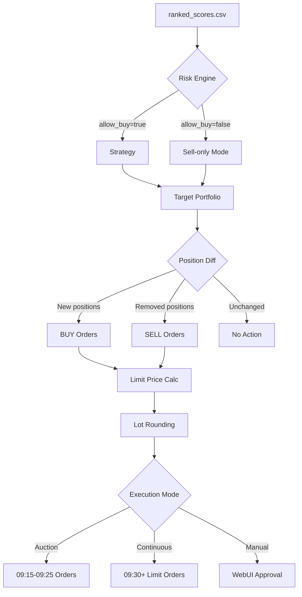

# Trading System

> Signal processing, portfolio construction, risk management, and order execution in FullStackAutoQuant.

---

## Table of Contents

- [System Overview](#system-overview)
- [Signal-to-Order Flow](#signal-to-order-flow)
- [Signal Processing](#signal-processing)
- [Strategy: TopK Rebalancing](#strategy-topk-rebalancing)
- [Weight Allocation](#weight-allocation)
- [Risk Management](#risk-management)
- [Order Execution](#order-execution)
- [Manual vs Automated Trading](#manual-vs-automated-trading)
- [Backtesting Engine](#backtesting-engine)
- [Configuration Reference](#configuration-reference)

---

## System Overview

The trading system converts model predictions into executable orders through a multi-stage pipeline with layered risk controls. Each stage is a standalone module that can be run independently or chained in an automated workflow.

```
Inference Output          Risk Engine            Strategy             Execution
(ranked_scores.csv)      (risk_state.json)      (orders.json)       (GM Trade API)
       │                       │                     │                     │
       ▼                       ▼                     ▼                     ▼
  ┌─────────┐           ┌───────────┐         ┌───────────┐        ┌───────────┐
  │ Signal  │──────────▶│   Risk    │────────▶│ TopK      │───────▶│  Order    │
  │ Parser  │           │ Evaluator │         │ Rebalance │        │ Placer    │
  └─────────┘           └───────────┘         └───────────┘        └───────────┘
       │                       │                     │                     │
  Parse CSV,            Drawdown check,        Target weights,       GM Trade API,
  validate schema,      limit-up/down,         buy/sell diff,        sliced orders,
  add confidence       confidence floor       lot rounding          auction mode
```

**Key design decisions:**
- **Deterministic pipeline:** Given the same inputs, the system produces identical orders
- **Fail-safe defaults:** If any stage fails, the system halts rather than placing unvalidated orders
- **Audit trail:** Every decision — from signal ranking to order placement — is logged to JSON files

---

## Signal-to-Order Flow



---

## Signal Processing

### Input: `ranked_scores.csv`

The signal parser (`trading/signals/parser.py`) reads the inference output:

```csv
instrument,score,confidence,rank
SH600519,0.0342,0.97,1
SZ000858,0.0298,0.95,2
SZ000001,0.0187,0.91,3
...
```

### Signal Validation

The schema validator (`trading/signals/schema.py`) enforces:

| Field | Type | Constraint |
|-------|------|-----------|
| `instrument` | string | Must match `[A-Z]{2}\d{6}` pattern |
| `score` | float | Finite, non-NaN |
| `confidence` | float | Range [0, 1] |
| `rank` | int | Positive, unique |

Invalid signals are logged and excluded. If the valid signal count drops below a minimum threshold, the system enters a defensive mode (sell-only).

### Signal-to-Symbol Conversion

The system converts between multiple symbol formats:

| Format | Example | Used By |
|--------|---------|---------|
| Qlib instrument | `SH600519` | Data pipeline, feature matrix |
| GM Trade symbol | `SHSE.600519` | JoinQuant API |
| Tushare code | `600519.SH` | Real-time quotes |

Conversion utilities in `trading/utils.py` handle all format transformations bidirectionally.

---

## Strategy: TopK Rebalancing

**Module:** `trading/strategy.py`

The core strategy is **TopK rebalancing** — on each trading day, construct a portfolio of the top-K ranked stocks by model score:

### Step 1: Select Top-K Instruments

```python
# Default: top 20 stocks by score
topk = config['portfolio']['topk']  # 20
signals_sorted = sorted(signals, key=lambda s: s['score'], reverse=True)
candidates = signals_sorted[:topk]
```

### Step 2: Apply Filters

Before allocation, several filters are applied:

1. **Confidence floor:** Drop stocks with `confidence < confidence_floor` (default: 0.9)
2. **Limit-up filter:** Remove stocks that hit the +10% daily price limit (cannot buy at limit-up price)
3. **Limit-down filter:** Remove stocks at -10% limit (cannot sell, but can hold)
4. **Risk engine veto:** If `allow_buy=false`, no new positions are opened

### Step 3: Compute Target Weights

After filtering, target portfolio weights are assigned (see [Weight Allocation](#weight-allocation)).

### Step 4: Compute Position Diff

Compare target portfolio against current positions (fetched from GM Trade API):

```
For each instrument:
  target_shares = round_down(target_weight × total_capital / price, lot_size)
  current_shares = positions.get(instrument, 0)
  
  if target_shares > current_shares → BUY (target - current)
  if target_shares < current_shares → SELL (current - target)
  if target_shares == current_shares → HOLD
```

### Step 5: Generate Orders

```json
[
  {"symbol": "SHSE.600519", "side": "buy",  "volume": 200, "price": 1856.00},
  {"symbol": "SZSE.000858", "side": "sell", "volume": 100, "price": 297.50}
]
```

---

## Weight Allocation

**Function:** `waterfill_with_cap()`

The system uses a **water-filling algorithm** with per-instrument caps to distribute capital:

### Equal-Weight Mode (default)

```
base_weight[i] = 1.0 / n_instruments
```

### Score-Weighted Mode

```
base_weight[i] = score[i] / sum(scores)
```

### Rank-Weighted Mode

```
base_weight[i] = (n - rank[i] + 1) / sum(1..n)
```

### Water-Fill Normalization

After computing base weights, the water-fill algorithm enforces a per-name cap (default: `max_weight=0.05` = 5%):

```
1. Normalize base_weights to sum to invest_ratio (default: 0.95, reserving 5% cash)
2. If any weight > max_weight:
   a. Cap it at max_weight
   b. Redistribute the excess proportionally among uncapped names
   c. Repeat until no name exceeds the cap
3. If all names hit the cap before reaching invest_ratio → leftover stays as cash
```

**Why 5% cash reserve?** Provides a buffer for transaction costs and intraday price movements. The portfolio never goes fully invested, reducing the risk of margin shortfalls.

---

## Risk Management

**Modules:** `trading/risk/service.py`, `trading/risk/manager.py`

Risk management operates as a multi-layer filter between signals and execution:

### Layer 1: Drawdown Monitoring

| Metric | Threshold | Action |
|--------|-----------|--------|
| Single-day drawdown | ≥ 3% | `allow_buy = false` |
| Rolling 5-day drawdown | ≥ 8% | `allow_buy = false` |

Drawdowns are computed from `nav_history.csv` — a daily equity curve log.

### Layer 2: Limit-State Detection

Using the previous two closing prices from `daily_pv.h5`:

```python
change = (last_close / prev_close) - 1.0

if change >= +9.5%:  # limit-up (with 0.5% tolerance)
    limit_up_symbols.append(symbol)
    
if change <= -9.5%:  # limit-down
    limit_down_symbols.append(symbol)
```

- **Limit-up stocks** are excluded from BUY orders (cannot purchase at price ceiling)
- **Limit-down stocks** are excluded from SELL orders (cannot sell at price floor)

### Layer 3: Confidence Filtering

Stocks with `confidence < confidence_floor` are excluded from the TopK candidate list. This uses the MC Dropout uncertainty estimation from the inference pipeline.

### Layer 4: Override Mechanism

For special situations, `--override_buy` flag allows manual override of the drawdown-triggered buy ban. This is logged for audit purposes.

### Risk State Output

```json
{
  "allow_buy": true,
  "day_drawdown": 0.012,
  "rolling5d_drawdown": 0.035,
  "limit_up_symbols": ["SHSE.600519"],
  "limit_down_symbols": [],
  "reasons": []
}
```

---

## Order Execution

**Module:** `trading/execution.py`

### JoinQuant GM Trade Integration

The execution layer interfaces with the GM Trade API for A-share order placement:

```python
# Authentication
set_endpoint(GM_ENDPOINT)
set_token(GM_TOKEN)
set_account_id(GM_ACCOUNT_ID)
```

### Price Determination

For each order, the system determines the limit price through a multi-source approach:

| Source | Priority | Used When |
|--------|----------|-----------|
| Strategy-computed price | 1 (highest) | Reference price from `daily_pv.h5` |
| Tushare real-time quote | 2 | Fallback with Sina/DC provider |
| Previous close | 3 (lowest) | Last resort |

**Price alignment:** All prices are rounded to the exchange tick size (0.01 CNY for A-shares).

### Execution Modes

#### Auction Mode (Pre-Market)

For orders placed during the 09:15–09:25 call auction window:
- Uses `OrderType_Limit` at the computed limit price
- Orders are submitted before 09:25 cutoff
- Unfilled orders can be modified during 09:25–09:30

#### Continuous Mode (Market Hours)

For orders placed during 09:30–15:00:
- Uses `OrderType_Limit` at a bounded price
- Buy price: `min(limit_up_price, reference_price × (1 + slippage_bps/10000))`
- Sell price: `max(limit_down_price, reference_price × (1 - slippage_bps/10000))`

### Order Slicing

Large orders are split into smaller slices to reduce market impact:

```python
# Max slices for buy orders (default: 3)
max_slices = config['order']['max_slices_open']

# Each slice is rounded down to lot_size (100 shares for A-shares)
slice_volume = round_down(total_volume / max_slices, 100)
```

### Dry-Run Mode

```bash
python -m fullstackautoquant.trading.execution \
  --orders orders.json \
  --config configs/trading.auto.local.yaml \
  --dry-run  # Log orders without placing them
```

---

## Manual vs Automated Trading

### Automated Workflow

The scheduler (`trading/scheduler.py`) orchestrates the full pipeline:

```
09:00  Data update       (qlib_update.sh)
09:05  Factor synthesis  (factor_synthesis.py)
09:08  Feature build     (build_features.py)
09:10  Inference          (inference.py)
09:12  Risk evaluation    (risk/manager.py)
09:13  Strategy          (strategy.py)
09:15  Execution          (execution.py, auction mode)
```

The `run_once.py` script wraps this as a single invocation:

```bash
python -m fullstackautoquant.trading.run_once \
  --config configs/trading.auto.local.yaml
```

### Manual Workflow

The manual workflow (`trading/manual_workflow/simulator.py`) adds a human-in-the-loop confirmation step:

1. **Signal generation:** Model produces ranked scores (same as automated)
2. **Signal queuing:** Orders enter a confirmation queue with a configurable delay (default: 0 days)
3. **Human review:** The WebUI displays pending orders for approval/rejection
4. **Execution:** Approved orders are forwarded to the execution layer

The simulator tracks:
- `executed` — Orders that were confirmed and placed
- `rejected` — Orders explicitly rejected by the operator
- `expired` — Orders that exceeded the confirmation window

### Configuration

```yaml
manual:
  enabled: true
  confirm_delay_days: 0      # Process immediately (no delay)
  max_signals_per_day: 5     # Limit daily order count
  min_confidence: 0.95       # Stricter than automated mode
  record_rejected: true      # Log rejected orders for audit
  partial_fill_ratio: 1.0    # Allow full fill
```

---

## Backtesting Engine

**Modules:** `backtest/engine.py`, `backtest/pipeline.py`, `backtest/metrics.py`

### Architecture

The backtesting engine uses a **modular component architecture**:

```
BacktestEngine
├── SignalProvider        ← loads/generates ranked signals per day
├── RiskEvaluator         ← mirrors live risk checks
├── StrategyRunner        ← TopK rebalancing (same code as live)
├── ExecutionSimulator    ← simulates fills with slippage/costs
├── NAVTracker           ← tracks equity curve and drawdowns
└── Records              ← stores snapshots, trades, and metrics
```

Each component is a pluggable class that can be replaced for custom backtesting scenarios.

### Running a Backtest

```bash
python -m fullstackautoquant.backtest.run_backtest \
  --config configs/trading.auto.local.yaml \
  --start 2022-01-01 \
  --end 2023-12-31 \
  --initial-capital 1000000
```

### Configuration

```python
BacktestConfig(
    start_date="2022-01-01",
    end_date="2023-12-31",
    initial_capital=1_000_000.0,
    rebalance_frequency="daily",
    allow_short=False,
    max_backtest_days=2000,
    portfolio=PortfolioParams(topk=20, invest_ratio=0.95, max_weight=0.05),
    costs=CostParams(commission=0.001, stamp_tax=0.001, slippage_bps=5.0),
)
```

### Dot-Notation Overrides

The config supports nested overrides for parameter sweeps:

```python
config.with_overrides({
    "portfolio.topk": 30,
    "costs.slippage_bps": 10.0,
})
```

### Parameter Grid Search

```python
from fullstackautoquant.backtest.config import expand_parameter_grid

grid = {
    "portfolio.topk": [10, 20, 30],
    "costs.slippage_bps": [2, 5, 10],
}

for config in expand_parameter_grid(base_config, grid):
    result = BacktestEngine(config).run()
    print(f"TopK={config.portfolio.topk} Slippage={config.costs.slippage_bps} → Sharpe={result.sharpe:.2f}")
```

### Performance Metrics

| Metric | Formula |
|--------|---------|
| Total Return | `(final_equity / initial_capital) - 1` |
| Annualized Return | `(cumulative)^(252/n_days) - 1` |
| Max Drawdown | `min(equity / running_peak - 1)` |
| Sharpe Ratio | `(mean_excess_return × 252) / (std_daily × √252)` |
| Volatility | `std(daily_returns) × √252` |
| Calmar Ratio | `annualized_return / |max_drawdown|` |

Risk-free rate: 2% annually (configurable).

### Backtest Artifacts

Each run produces:

```
backtest_runs/
└── 2024-01-15_10-30-00/
    ├── config.json           # Full configuration snapshot
    ├── equity_curve.csv      # Daily equity values
    ├── trades.csv            # All executed trades
    ├── positions_snapshots/  # Daily position snapshots
    └── summary.json          # Performance metrics
```

---

## Configuration Reference

### Trading Config (`trading.auto.local.yaml`)

```yaml
# Portfolio parameters
portfolio:
  topk: 20                   # Number of stocks to hold
  invest_ratio: 0.95         # Fraction of capital to invest (5% cash buffer)
  max_weight: 0.05           # Max weight per instrument (5%)
  lot: 100                   # A-share minimum lot size
  confidence_floor: 0.9      # Min MC Dropout confidence
  weight_mode: "score"       # "equal", "score", or "rank"

# Risk management
risk:
  day_drawdown_limit: 0.03   # 3% single-day drawdown → stop buying
  rolling5d_drawdown_limit: 0.08  # 8% rolling-5d drawdown → stop buying
  enforce_limit_up_down_filter: true

# Order execution
order:
  mode: "auto"               # "auto" or "manual"
  auction_mode: true         # Use pre-market auction (09:15-09:25)
  max_slices_open: 3         # Split large orders into slices
  slippage_bps: 5.0          # Slippage tolerance in basis points
  limit_threshold: 0.095     # ±9.5% change = limit up/down

# Transaction costs
costs:
  commission: 0.001          # 0.1% commission
  stamp_tax: 0.001           # 0.1% stamp tax (sell only)
  min_commission: 5.0        # Minimum 5 CNY per trade

# File paths
paths:
  daily_pv: "fullstackautoquant/data/daily_pv.h5"
  combined_factors: "fullstackautoquant/data/combined_factors_df.parquet"
  ranked_csv: "output/ranked_scores.csv"
  logs_dir: "logs/"
```

---

## Source Files

| File | Description |
|------|-------------|
| [`trading/strategy.py`](../fullstackautoquant/trading/strategy.py) | TopK rebalancing strategy with water-fill weights |
| [`trading/execution.py`](../fullstackautoquant/trading/execution.py) | GM Trade API order execution |
| [`trading/risk/service.py`](../fullstackautoquant/trading/risk/service.py) | Risk evaluation service (drawdown, limits) |
| [`trading/risk/manager.py`](../fullstackautoquant/trading/risk/manager.py) | Risk manager CLI entry point |
| [`trading/signals/parser.py`](../fullstackautoquant/trading/signals/parser.py) | Signal CSV parser |
| [`trading/signals/schema.py`](../fullstackautoquant/trading/signals/schema.py) | Signal schema validator |
| [`trading/utils.py`](../fullstackautoquant/trading/utils.py) | Shared utilities (symbol conversion, config, I/O) |
| [`trading/scheduler.py`](../fullstackautoquant/trading/scheduler.py) | Automated daily workflow scheduler |
| [`trading/run_once.py`](../fullstackautoquant/trading/run_once.py) | Single-pass workflow runner |
| [`trading/manual_workflow/simulator.py`](../fullstackautoquant/trading/manual_workflow/simulator.py) | Manual confirmation workflow |
| [`backtest/engine.py`](../fullstackautoquant/backtest/engine.py) | Backtesting orchestrator |
| [`backtest/pipeline.py`](../fullstackautoquant/backtest/pipeline.py) | Modular backtesting pipeline |
| [`backtest/metrics.py`](../fullstackautoquant/backtest/metrics.py) | Performance metrics (Sharpe, MDD, Calmar) |
| [`backtest/config.py`](../fullstackautoquant/backtest/config.py) | Backtest config with dot-notation overrides |
| [`backtest/components/`](../fullstackautoquant/backtest/components/) | Pluggable components (NAV, risk, execution, signals) |
